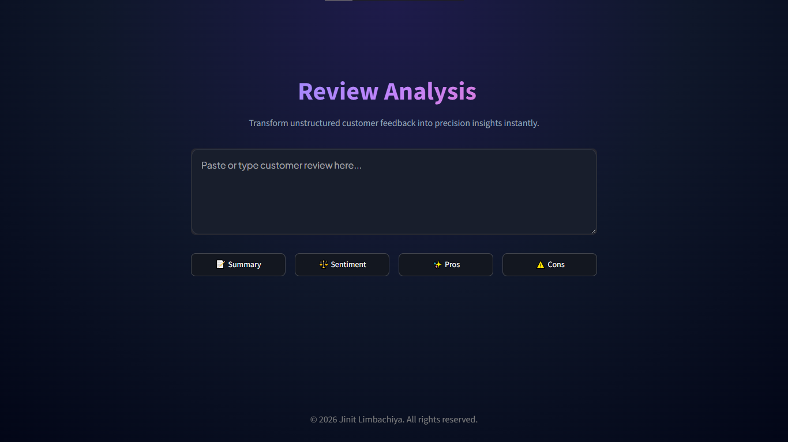
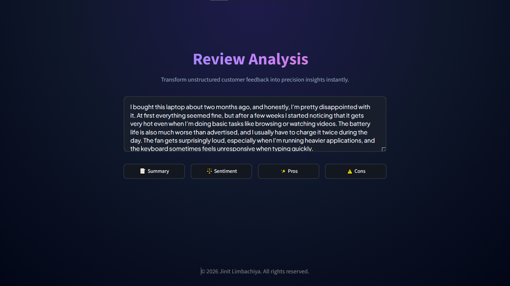
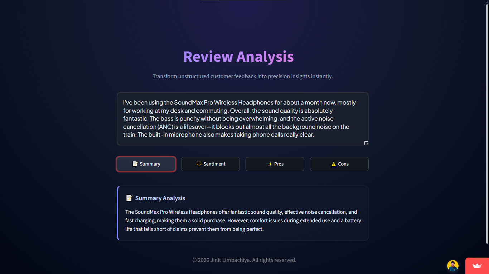
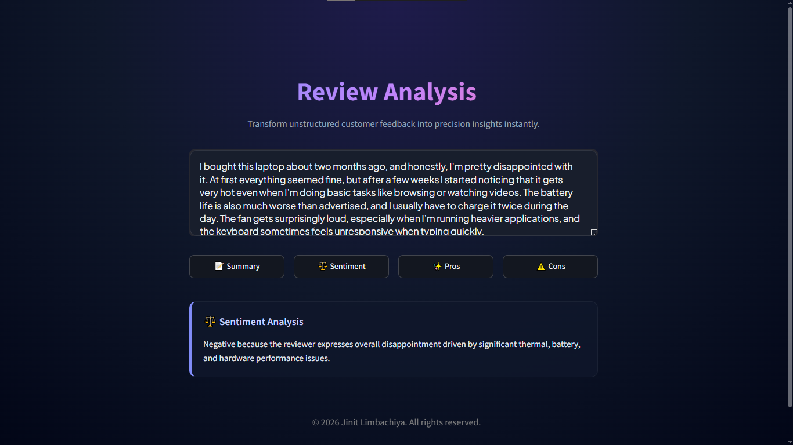
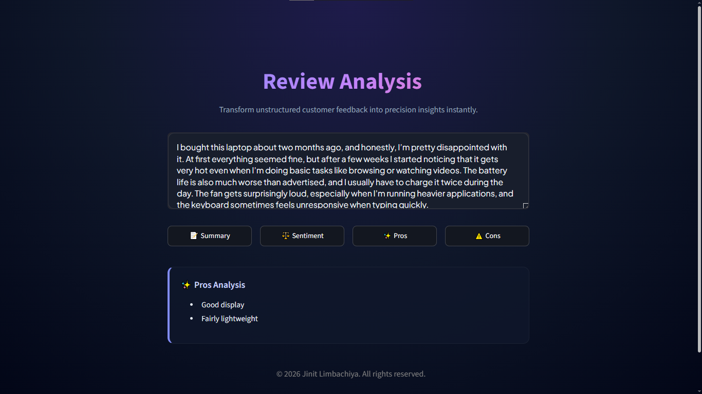
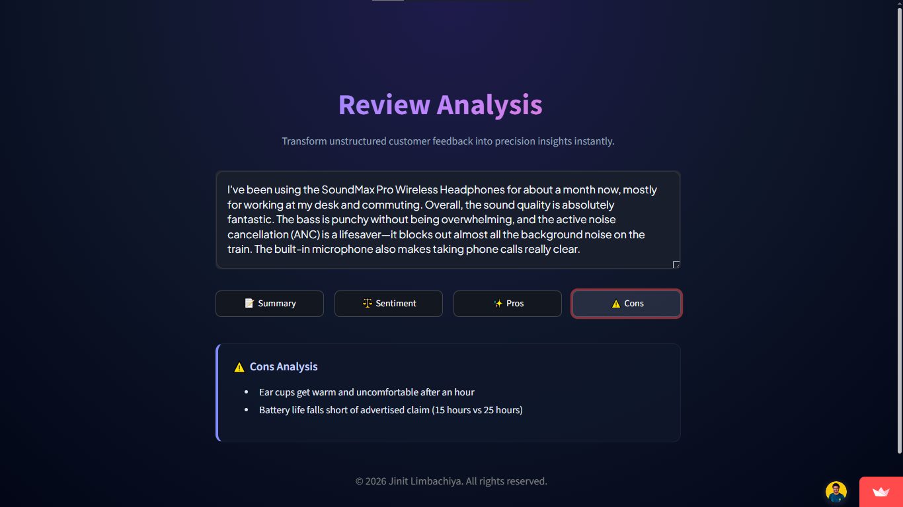

# 📝 Review Analysis

A fast, interactive web application that allows users to paste any product, service, or media review and instantly extract key actionable insights. 

🌐 **[Click here to view the live website!](https://reviewanalysis-jl.onrender.com/)**

<br>

---

## ✨ Features

* **Instant Summarization:** Condense long, wordy reviews into a quick 1-2 sentence overview.
* **Sentiment Analysis:** Automatically detect whether the tone of the review is Positive, Negative, or Neutral.
* **Pros & Cons Extraction:** Neatly list out the good and bad points mentioned by the reviewer.
* **Interactive UI:** Clean, responsive, and easy-to-use interface built for seamless analysis.

<br>

---

## 📸 How to Use the Website

Follow these simple steps to analyze your reviews:

**Step 1: Open the Website**<br>
Navigate to the live website using the link provided above.



**Step 2: Enter or Paste Your Review**<br>
Simply type or paste the review text you want to analyze into the main input box.



**Step 3: Get Your Results**<br>
Click any of the action buttons—**Summary**, **Sentiment**, or **Pros and Cons**—and the AI will instantly process the text and display your chosen result!






<br>

---

## 🛠️ Tech Stack

This project was built using the following technologies:
* **Frontend:** Streamlit
* **AI/LLM:** Google Gemini API (gemini-3.5-flash)
* **Language:** Python

<br>

---

## 🚀 Clone Repository (Local Setup)

Want to run this project on your own machine? It takes just a few steps:

1. **Clone the repository:**
    ```bash
    git clone [https://github.com/JinitLimbachiya/review-analysis.git](https://github.com/JinitLimbachiya/review-analysis.git)
    cd review-analysis

2. **Install Dependencies:**
    ```bash
    pip install -r requirements.txt

3. **Setup your API Key:**
    Create a .env file in the root folder and add your Gemini API key:
    ```bash
    GEMINI_API_KEY=your_api_key_here

4. **Run the app:**
    ```bash
    streamlit run src/app.py

<br>

---

## 📬 Contact

For questions, feedback, or collaborations, feel free to reach out:
* **Email:** limbachiyajinit@gmail.com
* **Linkedin:** https://www.linkedin.com/in/jinit-limbachiya-785ba8286/
* **YouTube:** https://www.youtube.com/@BitBroz